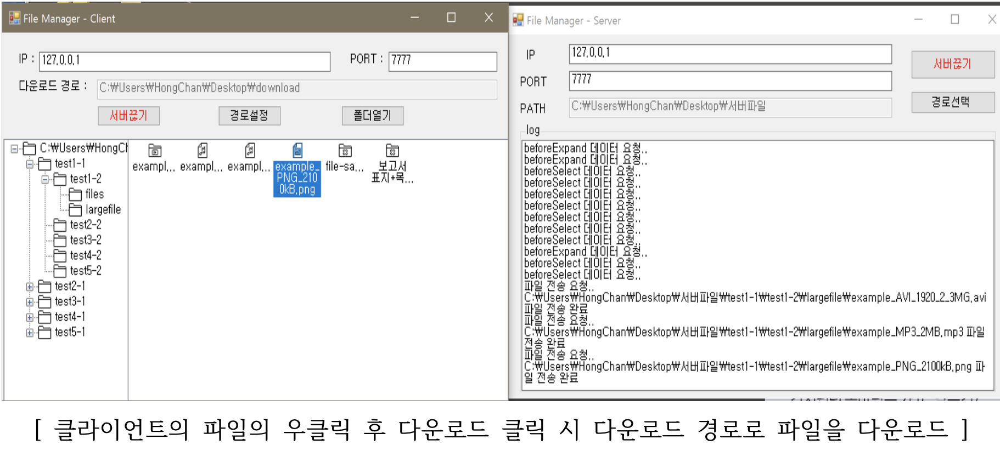

## Remote File Manager (원격 파일 접속 프로그램)

&nbsp;&nbsp;&nbsp;&nbsp;&nbsp;&nbsp;&nbsp;&nbsp;&nbsp;&nbsp;&nbsp;&nbsp;&nbsp;&nbsp;&nbsp;&nbsp;&nbsp;&nbsp;&nbsp;&nbsp;&nbsp;&nbsp;&nbsp;&nbsp;&nbsp;&nbsp;&nbsp;&nbsp;&nbsp;&nbsp;&nbsp;&nbsp;&nbsp;&nbsp;&nbsp;&nbsp;&nbsp;&nbsp;&nbsp;&nbsp;&nbsp;&nbsp;&nbsp;&nbsp;&nbsp;&nbsp;&nbsp;&nbsp;&nbsp;&nbsp;&nbsp;&nbsp;&nbsp;&nbsp;&nbsp;&nbsp;&nbsp;&nbsp;&nbsp;&nbsp;*2019-1 응용소프트웨어실습 프로젝트*

**Socket 통신을 이용하여 원격으로 파일을 확인하고 다운로드하는 프로그램을 구현**

**더 자세한 내용은 report.pdf 파일을 확인해주세요**

 

- **구현한 기능 소개**
  - 서버-클라이언트 모델
  - Socket Communication
  - 파일 탐색기
  - 상세정보 확인
  - 파일 전송

 

- **사용한 언어 및 도구, 라이브러리**
  + C#
  
  + Winform
  
     

+ **개발 환경**
  + Windows 10
  + Visual Studio

 

- **스크린샷**

  </img>

  

---

> 2019.11.5 최종 업데이트
>
> 광운대학교 소프트웨어학부 윤홍찬

